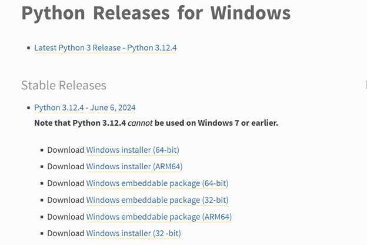
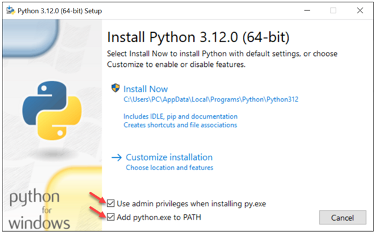

# Dev_Setup

Setup Development Environment

#Assignment: Setting Up Your Developer Environment

#Objective:
This assignment aims to familiarize you with the tools and configurations necessary to set up an efficient developer environment for software engineering projects. Completing this assignment will give you the skills required to set up a robust and productive workspace conducive to coding, debugging, version control, and collaboration.

#Tasks:

1. Select Your Operating System (OS):
   Choose an operating system that best suits your preferences and project requirements. Download and Install Windows 11. https://www.microsoft.com/software-download/windows11

2. Install a Text Editor or Integrated Development Environment (IDE):
   Select and install a text editor or IDE suitable for your programming languages and workflow. Download and Install Visual Studio Code. https://code.visualstudio.com/Download
3. Set Up Version Control System:
   Install Git and configure it on your local machine. Create a GitHub account for hosting your repositories. Initialize a Git repository for your project and make your first commit. https://github.com

4. Install Necessary Programming Languages and Runtimes:
   Instal Python from http://wwww.python.org programming language required for your project and install their respective compilers, interpreters, or runtimes. Ensure you have the necessary tools to build and execute your code.

5. Install Package Managers:
   If applicable, install package managers like pip (Python).

6. Configure a Database (MySQL):
   Download and install MySQL database. https://dev.mysql.com/downloads/windows/installer/5.7.html

7. Set Up Development Environments and Virtualization (Optional):
   Consider using virtualization tools like Docker or virtual machines to isolate project dependencies and ensure consistent environments across different machines.

8. Explore Extensions and Plugins:
   Explore available extensions, plugins, and add-ons for your chosen text editor or IDE to enhance functionality, such as syntax highlighting, linting, code formatting, and version control integration.

9. Document Your Setup:
   Create a comprehensive document outlining the steps you've taken to set up your developer environment. Include any configurations, customizations, or troubleshooting steps encountered during the process.

#Deliverables:

- Document detailing the setup process with step-by-step instructions and screenshots where necessary.
- A GitHub repository containing a sample project initialized with Git and any necessary configuration files (e.g., .gitignore).
- A reflection on the challenges faced during setup and strategies employed to overcome them.

INSTALLATION OF WINDOWS 11
My computer came with a fully set up windows 11 installation. However, this brought with it difficulties in installing the Flutter package. I downloaded the flutter for windows (Desktop applications)

THE VISUAL STUDIO CODE
From visual studio.com website, I downloaded the windows set up of the visual studio code. Once it was downloaded, I ran the installer (VSCodeUserSetup-{Version}.exe). it only took me a few minutes. By default, VS Code is installed in this directory; C:\Users\Owner\AppData\Roaming\Microsoft\Windows\Start Menu\Programs\Visual Studio Code.
The user setup did not require administrator privileges to run because it was installed under the system local app data folder. It required no elevation, thus it provided smoother background update.
By clicking (CTRL+SHIFT+X) to open the extension panel, I installed the python extensions in the vs code by typing “python” at the search bar and installing. Any other extensions can be added to the vs code by following the same process.

INSTALLATION OF GIT AND GITHUB
I downloaded the Git installation package for windows and ran the .exe file in my computer and followed the setup instructions.
I then created a Git-hub account, essential for the remote repositories, I signed up with my email address and password.
On the gitbash, I first ran it as an administrator, then I set up my git with a username, email and password. This was to ensure the integration/authentication of the git and the github account:
Git config --global user.name “Wamae Symon”
Git config –global user.email “symonwamae.k@gmail.com”
I then learnt how to create and clone a local repository; how to navigate to projects directories, initializing new git repositories, cloning existing repositories from a remote URLs, setting up remote repositories and staging and commit changes to my projects.
Cd /path to my projects
Git init
Git clone URLS
Git add .
Git commit –m “my commit message”
Git remote add origin “URLS i.e https://github.com/users/repository.git”

INSTALLATION OF PYTHON
I went to the python.org
I downloaded the stable version for the 64-bit, as per my computer specifications. [Download Windows installer (64- bit)]

I located the .exe file and ran it. I checked the box, “ Add python to path” to ensure python can be accessed from the command line. I then selected “INSTALL NOW”
To verify the installation, in the command prompt, I ran “python –version” and it returned the version of the python installed.

In regard to compilers, interpreters and runtimes, I only well understood the creation of the virtual environment for the project when we learnt creating projects and apps via Django. Here, a virtual environment is created for each Django project. Virtual environment was installed through the command; “pip install virtualenv”
The virtual environment had to be activated and deactivated through the following commands:
Cd source virtualenv/ scripts/activate
Cd deactivate

INSTALLATION OF PACKAGE MANAGER (PIP INSTALL) & DATABASE CONFIGURATION (MYSQL)
The “pip” python package managers facilitates the installation and management of additional libraries and other packages. Pip usually is included in the python installation.
To install and setup MySQL on Windows, first get the MySQL Installer from the MySQL Community Downloads website. Run the installer and select the appropriate setup type (Developer, Server, Full, or Custom).
I utilize the setup wizard to specify the server type, network, and authentication settings, including setting the root password and creating additional users as needed.
After the installation, I started the MySQL server via the MySQL Workbench. To verify the installation, open Command Prompt and type mysql -u root -p to log in using the root password. Additionally, I secured the installation by running mysql_secure_installation to set root passwords and disable remote root access.

#Submission:
Submit your document and GitHub repository link through the designated platform or email to the instructor by the specified deadline.

#Evaluation Criteria:\*\*

- Completeness and accuracy of setup documentation.
- Effectiveness of version control implementation.
- Appropriateness of tools selected for the project requirements.
- Clarity of reflection on challenges and solutions encountered.
- Adherence to submission guidelines and deadlines.

Note: Feel free to reach out for clarification or assistance with any aspect of the assignment.
